# 📊 YouTube Lakehouse - AWS Batch Data Engineering Pipeline

## 🚀 Overview

<p align="justify">This is the AWS-native rebuild of my earlier local YouTube data engineering project (Airflow + Spark + Postgres + Streamlit - see <a href="https://github.com/Arjun-M-101/Youtube_DE_Project">that repo</a> for the local version). Where the local version proved the Medallion Architecture on a single machine, this version proves the same design as real managed cloud infrastructure: event-driven ingestion, a serverless orchestrator, distributed Spark ETL on AWS Glue, an explicit data-quality gate, a private serverless warehouse, and a BI layer - all defined as code and torn down when not in use.</p>

<p align="justify">The first AWS account I tried this on turned out to be a dead end - Redshift and Glue were both blocked at the account level, not the IAM level (see <a href="#1-the-first-aws-account-was-never-viable---redshift-and-glue-blocked-at-the-account-level">Production Problem #1</a> below). This repo is the clean rebuild on a working account.</p>

<p align="justify">It ingests the <a href="https://www.kaggle.com/datasets/datasnaek/youtube-new">Kaggle &quot;YouTube Trending Video&quot; dataset</a> (multi-region CSV exports: US, IN, and optionally GB/CA/DE/FR/etc.), cleans and validates it, quarantines anything that doesn't meet quality rules, aggregates it into daily category/region summaries, loads it into a warehouse, and publishes a QuickSight dashboard on top.</p>

## 🏗️ Architecture

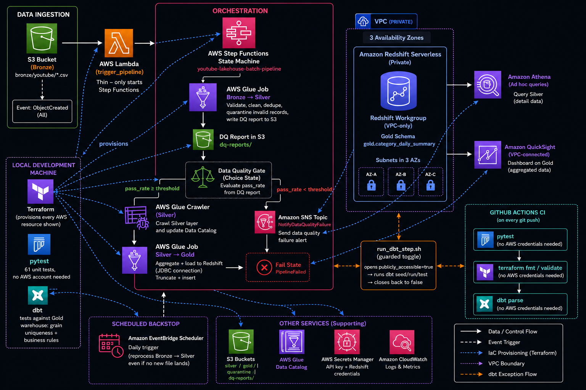

<p align="justify">A daily <strong>EventBridge Scheduler</strong> run also fires the same state machine with an empty <code>triggeredKey</code>, so Bronze → Silver reprocesses the full Bronze prefix as a backstop even if no new file lands that day.</p>

## ✅ Every AWS service this project actually uses

<p align="justify">Confirmed directly against the Terraform source - nothing here is aspirational, all of it is provisioned:</p>

| Service | Resource(s) in this repo | Role |
|---|---|---|
| **S3** | `s3.tf` | Bronze/Silver/Gold/Quarantine/DQ-reports/Control (Gold watermark) data lake, versioned, encrypted, public access blocked |
| **Lambda** | `lambda.tf` | Thin S3-event trigger - starts Step Functions, does no data processing |
| **Step Functions** | `step_functions.tf`, `step_functions/state_machine.json` | Orchestration: DQ branching, crawler wait/retry, success/failure handling |
| **Glue (Spark ETL)** | `glue.tf` - `bronze-to-silver`, `silver-to-gold` jobs (Glue 5.1, G.1X workers) | Distributed transform + aggregate; Silver->Gold supports an opt-in incremental watermark+`MERGE` mode via `gold_incremental_mode` (default: full refresh) |
| **Glue Data Catalog + Crawler** | `glue.tf` - `silver-crawler` | Schema discovery for Silver Parquet |
| **Redshift Serverless** | `redshift.tf` - private, 3-AZ, `publicly_accessible = false` | Gold warehouse (`gold.category_daily_summary`) |
| **Athena** | `athena.tf` - `youtube-lakehouse-detail` workgroup, 2 saved queries | Ad-hoc per-video Silver queries |
| **QuickSight** | `quicksight.tf` - VPC connection, Redshift data source, `category-daily-performance` dataset | BI dashboard on Gold |
| **SNS** | `sns.tf` | Pipeline/DQ failure alerts |
| **CloudWatch** | via Glue/Lambda logging flags | Logs + metrics |
| **EventBridge Scheduler** | `eventbridge.tf` | Daily backstop trigger |
| **Secrets Manager** | `iam.tf` - `youtube-lakehouse-youtube-data-api-key`, `youtube-lakehouse-redshift-credentials` | YouTube API key + Redshift credentials |
| **dbt** | `dbt_project/` | Generic + business-rule tests on the warehouse |
| **GitHub Actions** | `.github/workflows/ci.yml` | pytest + `terraform fmt`/`validate` + `dbt parse` on every push |

<p align="justify">If you're wondering "do I need S3? Redshift? Athena?" - yes, all of the above, no more and no less. There is nothing else to add.</p>

## 📂 Project Structure

```
youtube-lakehouse/
│
├── src/
│   ├── glue_jobs/
│   │   ├── bronze_to_silver.py     # Validate, clean, dedupe, DQ report, quarantine
│   │   └── silver_to_gold.py       # Aggregate + load into Redshift (JDBC)
│   ├── lambda/
│   │   └── trigger_pipeline.py     # Thin S3-event → Step Functions starter
│   ├── transform_logic.py          # Pure, unit-testable validation/aggregation logic
│   ├── api_client.py               # YouTube Data API v3 client (retry/backoff)
│   └── category_enrichment.py      # Parses category API responses
│
├── step_functions/
│   └── state_machine.json          # Orchestrator definition (source of truth)
│
├── terraform/                      # All infrastructure as code
│   ├── s3.tf, networking.tf, iam.tf
│   ├── lambda.tf, glue.tf, step_functions.tf, eventbridge.tf
│   ├── redshift.tf, athena.tf, quicksight.tf, sns.tf
│   └── terraform.tfvars.example    # Template - copy, never commit the real file
│
├── scripts/
│   └── run_dbt_step.sh             # Guarded publicly_accessible open/close + dbt seed/run/test in one deterministic pass
│
├── dbt_project/                    # Warehouse-side tests on Gold
│
├── tests/                          # pytest - runs with no AWS account needed
│   ├── test_transform_logic.py
│   ├── test_api_client.py
│   ├── test_category_enrichment.py
│   └── test_trigger_pipeline.py
│
├── reference/
│   └── youtube_categories.json     # Fallback category reference
│
├── sample_data/                    # Kaggle CSVs go here (gitignored - see below)
│
├── docs/
│   ├── ARCHITECTURE.md
│   └── PRODUCTION_DEPLOYMENT.md
│
├── screenshots/                    # Dashboard + pipeline proof (see below)
├── .github/workflows/              # CI: pytest + terraform fmt/validate + dbt parse
├── requirements.txt / requirements-dbt.txt
└── Makefile

```

## 🛠️ Prerequisites

- AWS account with billing alert configured (this project is designed to run for a few dollars and be torn down - see [Teardown](#-teardown--cost-control))
- AWS CLI v2, configured with credentials that can create IAM/S3/Glue/Redshift/QuickSight/Step Functions resources
- Terraform ≥ 1.5
- Python 3.11+ (matches Glue 5.1's Python runtime)
- A YouTube Data API v3 key ([console.cloud.google.com](https://console.cloud.google.com) → enable "YouTube Data API v3" → create credentials)
- A QuickSight account (Standard, free trial is fine) and your QuickSight user ARN
- Git and a GitHub account (see the push section below if this is your first time)

## 🔀 First time: push this project to GitHub

<p align="justify">Do this once, before or after deploying - it's independent of AWS.</p>

```bash
cd youtube-lakehouse
git init
git add .
git status                     # confirm no .tfstate, .venv/, tfvars, or credentials are staged - see the security section below
git commit -m "Initial commit: YouTube Lakehouse AWS data engineering project"

```

<p align="justify">Create a new <strong>empty</strong> repository at <a href="https://github.com/new">github.com/new</a> - name it <code>youtube-lakehouse</code>, leave "Add a README/.gitignore/license" <strong>unchecked</strong> since you already have all three locally. Then:</p>

```bash
git remote add origin https://github.com/<your-username>/youtube-lakehouse.git
git branch -M main
git push -u origin main

```

<p align="justify">If GitHub rejects your password over HTTPS, generate a Personal Access Token (GitHub → Settings → Developer settings → Personal access tokens) and use that in place of the password, or run <code>gh auth login</code> if you have the GitHub CLI installed.</p>

<p align="justify">Every push after this is just <code>git add . &amp;&amp; git commit -m "..." &amp;&amp; git push</code>.</p>

## ⚙️ Setup Instructions

### 1. Clone and set up Python

```bash
git clone https://github.com/<your-username>/youtube-lakehouse.git
cd youtube-lakehouse
python3 -m venv .venv
source .venv/bin/activate
pip install -r requirements.txt

```

### 2. Run the unit tests first (no AWS needed)

```bash
pytest tests/ -v

```

<p align="justify">These exercise validation rules, region resolution, deduplication, the DQ report formula, API retry/backoff, category-response parsing, and the Lambda trigger - all without touching AWS. Green tests here catch most logic bugs before they cost you a <code>terraform apply</code>.</p>

### 3. Configure Terraform variables

```bash
cd terraform
cp terraform.tfvars.example terraform.tfvars

```

<p align="justify">Edit <code>terraform.tfvars</code> and fill in <code>alert_email</code> and <code>quicksight_user_arn</code>. <strong>Never put the Redshift password in this file</strong> - it's supplied through an environment variable instead:</p>

```bash
export TF_VAR_redshift_admin_password='use-a-strong-password-here'

```

### 4. Deploy

```bash
terraform init
terraform validate
terraform plan

```

<p align="justify">Read the plan before applying - always. Then:</p>

```bash
terraform apply -var="redshift_admin_password=$TF_VAR_redshift_admin_password"

```

<p align="justify">Confirm the SNS subscription email that lands in your inbox - pipeline failure alerts won't reach you until you do.</p>

### 5. Store the YouTube API key in Secrets Manager

<p align="justify">Terraform creates the secret container; you populate the value (never in code, never in tfvars):</p>

```bash
aws secretsmanager put-secret-value \
  --secret-id youtube-lakehouse-youtube-data-api-key \
  --secret-string 'YOUR_YOUTUBE_API_KEY'

```

### 6. Get the data

```bash
mkdir -p sample_data

```

<p align="justify">Download the CSVs from <a href="https://www.kaggle.com/datasets/datasnaek/youtube-new">Kaggle &quot;YouTube Trending Video&quot; dataset</a> into <code>sample_data/</code>. <strong>Keep the original filenames</strong> (<code>USvideos.csv</code>, <code>INvideos.csv</code>, ...) - the pipeline resolves <code>region</code> from the filename, not from file content. A renamed file intentionally fails the <code>UNKNOWN_REGION</code> rule.</p>

### 7. Upload to trigger the pipeline

```bash
aws s3 cp sample_data/USvideos.csv s3://$(terraform output -raw lakehouse_bucket_name)/bronze/youtube/USvideos.csv

```

<p align="justify">Each upload independently triggers Lambda → Step Functions. Watch it in the Step Functions console (<code>youtube-lakehouse-batch-pipeline</code>) until it reaches <code>SUCCEEDED</code>. Repeat for IN, GB, or any other region file you want loaded - each run is a full, safe recompute (see <a href="#-data-flow">Data Flow</a> below for why that's safe).</p>

### 8. Verify the data landed

<p align="justify">Redshift (Gold table row counts):</p>

```bash
SECRET_ARN=$(aws secretsmanager describe-secret \
  --secret-id youtube-lakehouse-redshift-credentials \
  --query ARN --output text)

aws redshift-data execute-statement \
  --workgroup-name youtube-lakehouse-wg \
  --database youtube_lakehouse \
  --sql "SELECT region, COUNT(*) FROM gold.category_daily_summary GROUP BY region" \
  --secret-arn "$SECRET_ARN"

```

<p align="justify">Then <code>aws redshift-data describe-statement --id &lt;Id&gt;</code> and <code>get-statement-result</code> to see the counts.</p>

<p align="justify">Athena (per-video Silver detail - the Terraform already saved two queries for you):</p>

```bash
aws athena start-query-execution \
  --query-execution-context Database=youtube_lakehouse \
  --work-group youtube-lakehouse-detail \
  --named-query-id "$(aws athena list-named-queries --work-group youtube-lakehouse-detail --query 'NamedQueryIds[0]' --output text)"

```

<p align="justify">Or just open the Athena console, pick the <code>youtube-lakehouse-detail</code> workgroup, and run the saved <code>youtube-lakehouse-video-detail</code> or <code>youtube-lakehouse-likes-vs-comments</code> query directly - this is the easier path as a beginner.</p>

### 9. dbt tests against the warehouse (guarded open/close script)

<p align="justify">Redshift Serverless runs with <code>publicly_accessible = false</code> permanently baked in - that's what makes QuickSight's VPC connection work (see <a href="#16-dbt-seed-connection-timeout-on-a-redeploy---publicly_accessible--false-blocking-the-only-network-path-in">Production Problem #16</a>). But it also means dbt, running from your machine outside the VPC, has no network path to the workgroup at that setting - it'll hang for a few minutes and time out. Rather than hand-editing <code>redshift.tf</code> to flip it and remembering to flip it back, <code>publicly_accessible</code> is a Terraform variable now (<code>redshift_publicly_accessible</code> in <code>variables.tf</code>, default <code>false</code>), and <code>scripts/run_dbt_step.sh</code> drives the whole open-run-close sequence deterministically:</p>

```bash
cd dbt_project
python3 -m pip install -r ../requirements-dbt.txt
dbt deps
cd ..
chmod +x scripts/run_dbt_step.sh   # once
export TF_VAR_redshift_admin_password='use-the-same-password-as-before'   # if not already exported
./scripts/run_dbt_step.sh

```

<p align="justify">What it does, in order: reads your current public IP and passes it straight to Terraform as dbt_local_access_cidr (no manual CIDR editing, no pause-and-eyeball step anymore) → terraform apply -var="redshift_publicly_accessible=true" -var="dbt_local_access_cidr=&lt;your-ip&gt;/32" to open the workgroup, scoped to just that IP → dbt seed, dbt run, dbt test → terraform apply with no CIDR override, so it falls back to the unroutable 127.0.0.1/32 default, closing both the workgroup and the ingress rule back down. By the time it prints <code>Done.</code>, dbt has already succeeded and <code>gold.category_daily_summary</code> already has real data - go straight to Step 10.</p>

<p align="justify"><strong>If the script exits with an error partway through:</strong> <code>set -euo pipefail</code> stops it immediately, which leaves the workgroup <code>publicly_accessible = true</code> on purpose - so you can debug the live connection instead of losing it. Don't walk away from a failed run; either fix and rerun, or close it back up manually before you stop:</p>

```bash
terraform apply -var="redshift_admin_password=$TF_VAR_redshift_admin_password"

```

### 10. Build the QuickSight dashboard

<p align="justify">⚠️ <strong>Do not run this step before Step 9 has finished successfully.</strong> Steps 1→9 have a hard ordering dependency - the workgroup has to go through its dbt-open/dbt-close cycle <em>before</em> QuickSight ever reads from it. Running this step out of order (as happened once during a redeploy - see <a href="#16-dbt-seed-connection-timeout-on-a-redeploy---publicly_accessible--false-blocking-the-only-network-path-in">Production Problem #16</a>) leaves the QuickSight dataset pointed at a workgroup that either has no data yet or, worse, is unreachable when Step 9 runs next. If a debugging session ever suggests jumping ahead "to fix an earlier error," that's the signal to stop and ask why before doing it.</p>

<p align="justify">Terraform provisions the VPC connection, Redshift data source, and dataset - you build the visuals by hand (QuickSight analyses aren't cleanly Terraform-managed). In the QuickSight console:</p>

1. Open the `Category Daily Performance` dataset (`youtube-lakehouse-category-daily-performance`) → **Create analysis**.
2. Build at minimum: a bar chart of `total_views` by `category_name`, a line chart of `video_count` by `trending_date` colored by `region`, and a pivot table of `total_views` / `avg_engagement_ratio` grouped by `region` → `category_name`.
3. **On the engagement-ratio field specifically:** set its aggregation to **Average**, not the default **Sum** - see the [Production Problems](#-production-problems-i-hit---and-how-i-fixed-them) log below for why this matters and what it looks like when it's wrong.
4. **Share → Publish dashboard.**

### 11. Capture proof before teardown

<p align="justify">QuickSight access disappears the moment you <code>terraform destroy</code>. Screenshot everything <strong>before</strong> tearing anything down - see <a href="#-screenshots">Screenshots</a> below for exactly what to capture and where it goes.</p>

## 🔄 Data Flow

### Bronze (raw landing)
<p align="justify">Untransformed CSVs land at <code>s3://&lt;bucket&gt;/bronze/youtube/&lt;REGION&gt;videos.csv</code>. No schema enforcement here beyond the S3 event trigger.</p>

### Silver (validated, cleaned, deduplicated) - `bronze_to_silver.py`
- Spark reads the Bronze CSV distributed (no `.collect()` onto the driver).
- Before any row is touched, `detect_schema_drift()` diffs the file's actual header against an explicit expected-columns list. A genuinely new column is logged as a `SCHEMA_DRIFT` warning and passed through untouched; a missing required column fails the file immediately with one clear reason, instead of surfacing as a wall of confusing per-row errors.
- Each row is validated **partition-by-partition** via `validate_and_clean_row`: required fields present, numeric fields parseable and non-negative, `trending_date` parseable, region resolved from filename.
- Rows that fail any check are quarantined to `s3://<bucket>/quarantine/youtube/` partitioned by `quarantine_reason` - nothing is silently dropped.
- Surviving rows are deduplicated on `(video_id, trending_date, region)` - this grain matters: it's what stops a legitimately repeated video on a different day, or the same video trending in two different regions, from being treated as an accidental duplicate.
- A **data-quality report** (`total_bronze_rows`, `validity_rate`, `duplicate_rate`, `reasons` breakdown) is written to S3 and read back by Step Functions to decide whether to continue.
- Before row-level validation, the file's **header** is diffed against an explicit expected-columns list (`detect_schema_drift` in `transform_logic.py`): new columns are logged as a `SCHEMA_DRIFT` warning and passed through untouched (additive, non-breaking), while a missing *required* column fails the DQ gate immediately with a clear reason instead of surfacing as a wall of confusing per-row `MISSING_REQUIRED_FIELD` rejects. The result is recorded in the DQ report under `schema_drift`.
- Category names are enriched via a live YouTube Data API v3 call, with the last-known-good reference JSON in S3 as a fallback if the API call fails.
- Output is written to `s3://<bucket>/silver/youtube/`, partitioned by `region`/`trending_date`, with **dynamic partition overwrite** - a fresh run for one region/date only replaces that partition, leaving every other region and date untouched.

### Gold (analytics-ready) - `silver_to_gold.py`
- Every run re-reads the **entire** Silver dataset (all regions, all history so far) and does a full distributed `groupBy(category_id, trending_date, region)` aggregation - `video_count`, `total_views`, `total_likes`, `total_dislikes`, `total_comments`, `avg_views_per_video`, `avg_engagement_ratio`.
- Category names are joined in **after** aggregation (joining before it would get silently dropped by the groupBy - it's neither a grouping key nor an aggregate).
- Unknown category IDs are labeled explicitly (`Unknown (24)`) rather than dropped.
- Written to S3 Gold (partitioned, overwrite) and loaded into Redshift via JDBC using a stage-table `TRUNCATE` + `INSERT` pattern - this is a **full refresh, not an incremental append** by default, which is what keeps every run consistent with zero risk of double-counting or partial state.
- **Incremental mode (opt-in, off by default):** setting the Terraform variable `gold_incremental_mode = true` switches this job to watermark-based processing instead - it reads only Silver rows with `trending_date` newer than a watermark stored at `s3://<bucket>/control/gold_watermark.json`, **appends** (rather than overwrites) the new Gold partitions in S3, and `MERGE`s into Redshift instead of `TRUNCATE`+`INSERT`, advancing the watermark only after a successful write. Leaving the variable at its default (`false`) preserves the original full-refresh behavior byte-for-byte.

### Serving
- **Redshift Serverless** (private VPC, 3 AZs, `publicly_accessible = false`) holds `gold.category_daily_summary` as the primary analytics table.
- **Athena** queries Silver Parquet directly for ad hoc per-video detail without forcing everything through Redshift.
- **QuickSight**, VPC-connected to Redshift, serves the published dashboard.
- **dbt** runs generic + business-rule tests against the warehouse tables (uniqueness on the `(category_id, trending_date, region)` grain, non-null checks, accepted-value checks on `region`).

## 🔧 Production Problems I Hit - And How I Fixed Them

<p align="justify">This section is the part I actually think is worth reading. Anyone can post a working pipeline; here's what actually went wrong building it and how each was diagnosed and closed, in the order I hit them - starting with the AWS account that never worked at all, before any of the code-level problems below.</p>

### 1. The first AWS account was never viable - Redshift and Glue blocked at the account level
<p align="justify"><strong>Symptom:</strong> <code>terraform apply</code> failed in three different ways on the same account, over roughly two weeks: <code>SubscriptionRequiredException</code> on <code>CreateNamespace</code> for Redshift Serverless, <code>AccessDeniedException: Account &lt;id&gt; is denied access</code> on every Glue job/crawler creation, and <code>ResourceNotFoundException: Account information for account &lt;id&gt; is not found</code> on QuickSight - despite the IAM user/role having full <code>AdministratorAccess</code>. <strong>Diagnosis:</strong> Three unrelated-looking errors, one root cause each, none of them an IAM problem:</p>
- Since AWS split new accounts into Free/Paid Plan (July 2025), **Redshift is excluded from the Free Plan outright** - not rate-limited, not a trial restriction, just unavailable until the account is upgraded to Paid.
- Glue's `AccessDeniedException` is a **backend fraud-prevention hold** AWS places on new/recently-upgraded accounts for certain compute-provisioning APIs (crawler/job creation specifically), to block abuse like crypto-mining. It happens before IAM is ever evaluated, so no policy change fixes it - the exact same Terraform that failed one day applied cleanly with zero code changes once AWS lifted the hold.
- QuickSight's error was simpler: the account signup itself had failed with a generic "Oops" error and never actually completed.
<p align="justify"><strong>Fix:</strong> Upgraded the account to the Paid Plan (confirmed this doesn't forfeit existing free-tier credits or "Always Free" allowances - it's a status change, not a purchase). For the Glue hold specifically, filed an AWS Support case under Billing &amp; Accounts and waited for AWS to manually clear it - a real multi-day wait, not something retriable from the terminal. Even after the Paid Plan upgrade and the Glue hold clearing, the account accumulated enough tangled partial state (see #5 below) that it was eventually more practical to build cleanly on a second AWS account than keep excavating the first one. <strong>Why this matters:</strong> this is the actual reason this repo exists as an "AWS-native rebuild" - the earlier local-only version of this project (Airflow/Spark/Postgres/Streamlit) worked around exactly this by never touching Glue or Redshift Serverless at all.</p>

### 2. AWS security-group rule rejected - invalid characters
<p align="justify"><strong>Symptom:</strong> <code>terraform apply</code> failed adding an ingress rule description. <strong>Cause:</strong> AWS security-group description fields only accept a limited character set - an em dash (<code>-</code>) and an apostrophe in my description text weren't allowed. <strong>Fix:</strong> Rewrote the description in plain ASCII. Small, but a good reminder that Terraform errors are usually AWS API-level constraints, not Terraform bugs - read the actual error text before assuming the tool is wrong.</p>

### 3. Wrong security group edited entirely
<p align="justify"><strong>Symptom:</strong> Same error category as above, but fixing the syntax didn't fix the underlying problem. <strong>Cause:</strong> I'd pasted the ingress rule into <code>aws_security_group.glue_endpoints</code> (VPC interface endpoint HTTPS access) instead of the Redshift-access security group. Wrong resource, not just wrong syntax. <strong>Fix:</strong> Confirmed via <code>terraform plan</code> diff which resource was actually being changed before applying, and moved the rule to the correct security group in <code>networking.tf</code>.</p>

### 4. Stray Terraform syntax error from a bad copy-paste
<p align="justify"><strong>Symptom:</strong> <code>Error: Missing newline after block definition</code>. <strong>Cause:</strong> A closing <code>}</code> from one resource block got merged onto the same line as the next resource's first attribute during a manual edit. <strong>Fix:</strong> Rewrote the affected file cleanly rather than patching around it - for HCL, when a paste goes wrong it's faster to replace the whole file than to hunt for the exact character.</p>

### 5. A wiped local Terraform state cascaded into ~10 separate "already exists" errors
<p align="justify"><strong>Symptom:</strong> After clearing local Terraform state to work around an earlier networking tangle, every subsequent <code>terraform apply</code> failed on a <em>different</em> resource each time: <code>EntityAlreadyExists</code> (IAM roles), <code>ResourceExistsException</code> (Secrets Manager), <code>AlreadyExistsException</code> (Glue Catalog database), <code>ConflictException</code> (Redshift namespace, then workgroup), <code>ResourceAlreadyExistsException</code> (CloudWatch log group), <code>InvalidRequestException: WorkGroup is already created</code> (Athena), <code>ResourceConflictException</code> (Lambda function, then separately its S3-invoke permission) - plus, unrelated but from the same repeated-failed-build cycle, <code>VpcLimitExceeded</code> (old half-built VPCs from earlier attempts eating the 5-per-region cap) and <code>InvalidSubnet.Conflict</code> on overlapping CIDR blocks. <strong>Cause:</strong> Deleting local Terraform state doesn't delete the real AWS resources it was tracking - it just makes Terraform forget it owns them. The next <code>plan</code> tries to create everything from scratch and collides with what's already live, one resource at a time as each successive error is fixed. <strong>Fix:</strong> Built a dedicated <code>imports.tf</code> and used Terraform <code>import</code> blocks to reattach each already-existing resource to its Terraform address - VPC, Redshift namespace and workgroup, IAM roles, Secrets Manager secrets, CloudWatch log group, Athena workgroup, Glue Catalog database, Lambda function - instead of trying to delete and recreate real infrastructure. Manually deleted the genuinely orphaned dead VPCs in the console first to clear the VPC-limit block. <strong>Takeaway:</strong> never wipe local Terraform state to "start clean" once real resources exist behind it - <code>terraform import</code> is the correct tool. This one shortcut is what turned a single networking mistake into roughly a dozen cascading, unrelated-looking errors across almost every service in the stack.</p>

### 6. Step Functions IAM role not authorized to access the Log Destination
<p align="justify"><strong>Symptom:</strong> <code>AccessDeniedException: The state machine IAM Role is not authorized to access the Log Destination</code> on <code>CreateStateMachine</code>, persisting across several <code>apply</code> attempts. <strong>Diagnosis:</strong> A hand-added <code>aws_cloudwatch_log_resource_policy</code> block was using a dynamic ARN with a trailing wildcard (<code>${aws_cloudwatch_log_group.sfn_logs.arn}:*</code>) directly inside the policy JSON - CloudWatch Log Resource Policies reject variable/wildcard configurations in that position, so the policy silently failed to register, which meant Step Functions still had no grant to write to the log group. <strong>Fix:</strong> Removed the ad-hoc resource-policy block entirely and instead scoped the project's existing <code>data "aws_iam_policy_document" "sfn_log_delivery"</code> block's <code>resources</code> list explicitly to the log group's ARN (both the bare ARN and the <code>:*</code> variant, as separate list entries rather than one wildcarded string) - using the built-in policy-document pattern the project already had, instead of a hand-rolled one.</p>

### 7. Redshift connection test timing out from a BI tool
<p align="justify"><strong>Symptom:</strong> <code>Database Error: ('connection time out', TimeoutError(110, 'Connection timed out'))</code>. <strong>Cause:</strong> Networking path into the private Redshift Serverless workgroup wasn't fully wired for the client trying to reach it. <strong>Fix:</strong> Verified and corrected the security group / subnet routing so the connection resolved in seconds instead of hanging for ~5 minutes before failing.</p>

### 8. QuickSight Terraform schema drift against the pinned provider version
<p align="justify"><strong>Symptom:</strong> <code>Error: Insufficient parameters blocks</code> / <code>Error: Unsupported block type</code> on the QuickSight data-source and data-set resources. <strong>Cause:</strong> The QuickSight resource schema differs between provider versions, and my HCL didn't match the block names/nesting for the <code>hashicorp/aws</code> version actually pinned in <code>.terraform.lock.hcl</code> (<code>permissions(data_set)</code> vs <code>permission(data_source)</code>, <code>parameters</code> vs <code>data_source_parameters</code>). <strong>Fix:</strong> Checked the exact provider docs for the pinned version (6.62.0) rather than the latest docs online, and corrected the block structure to match.</p>

### 9. QuickSight account registration stuck on a generic error
<p align="justify"><strong>Symptom:</strong> QuickSight signup failed with a non-specific "Oops" error, more than once, blocking every <code>aws_quicksight_*</code> resource with <code>ResourceNotFoundException</code>. <strong>Cause:</strong> Turned out to be an AWS-side platform issue tied to the account/name combination, not a retriable client error. <strong>Fix:</strong> Used a fresh, collision-proof account name (previously-tried names can stay "reserved" for a while even after a failed signup) and it went through cleanly on retry. Lesson: after a couple of identical failures with no new information, it's a support-case situation, not a "try again" situation.</p>

### 10. QuickSight `CreateDataSource` - unsupported resource-permissions state
<p align="justify"><strong>Symptom:</strong> <code>InvalidParameterValueException: Resultant state of ResourcePermissions on this resource is not supported.</code> <strong>Cause:</strong> The <code>actions</code> list on the QuickSight permissions block was missing <code>DeleteDataSource</code>, so it matched neither of QuickSight's two accepted permission sets exactly. <strong>Fix:</strong> Matched the actions list exactly to one of AWS's supported permission sets.</p>

### 11. QuickSight data source stuck in `CREATION_FAILED` - `GENERIC_SQL_FAILURE`
<p align="justify"><strong>Symptom:</strong> <code>unexpected state 'CREATION_FAILED' ... GENERIC_SQL_FAILURE: The connection attempt failed.</code> <strong>Cause:</strong> The Redshift Serverless workgroup had <code>publicly_accessible = true</code>. Counter-intuitively, that breaks in-VPC clients like a QuickSight VPC-connection ENI, because the private-DNS resolution path AWS sets up for VPC-internal clients isn't configured the same way when the workgroup is also publicly routable. <strong>Fix:</strong> Flipped the workgroup to <code>publicly_accessible = false</code> (AWS's own recommended pattern for QuickSight-via-VPC-connection). Confirmed by the data source moving to <code>Creation complete</code> on the next apply.</p>

### 12. QuickSight `CreateDataSet` - physical table map key regex
<p align="justify"><strong>Symptom:</strong> <code>ValidationException: ... Map keys must satisfy constraint: ... pattern: [0-9a-zA-Z-]*</code> <strong>Cause:</strong> My <code>physical_table_map</code> key used an underscore, which QuickSight's key regex doesn't allow (only alphanumerics and hyphens). <strong>Fix:</strong> Renamed the key to use a hyphen instead of an underscore.</p>

### 13. QuickSight `CreateDataSet` - resource-permissions mismatch again, different resource
<p align="justify"><strong>Symptom:</strong> Same <code>ResourcePermissions</code> error as #10, this time on the data set instead of the data source. <strong>Cause:</strong> Same root cause as #10 - the actions list didn't exactly match one of QuickSight's two accepted permission sets. <strong>Fix:</strong> Same fix, applied to the data-set resource's permission block.</p>

### 14. The big one: pipeline failed loading `INvideos.csv` - data quality gate
<p align="justify"><strong>Symptom:</strong> Step Functions execution ended in <code>PipelineFailed</code>, cause: <em>"YouTube Lakehouse batch pipeline failed or was blocked by the data quality gate."</em> US and IN had already loaded successfully; IN was the first file to actually trip the gate. <strong>Diagnosis:</strong> Pulled the DQ report the job had already written to S3 (<code>dq-reports/bronze-to-silver/&lt;run-id&gt;.json</code>) instead of guessing from the error message alone:</p>

```json
{
  "total_bronze_rows": 37352,
  "validated_clean_rows": 32458,
  "duplicate_rows": 4894,
  "pass_rate": 0.868976,
  "threshold": 0.95,
  "pass": false,
  "reasons": { "DUPLICATE_ROW": 4894 },
  "rejected_validation_rows": 0
}

```

<p align="justify"><code>rejected_validation_rows</code> was <strong>zero</strong> - every row in the file was structurally valid. The entire shortfall was 4,894 exact duplicate rows (13.1% of the file), a known characteristic of the India export in this Kaggle dataset. The original DQ formula scored duplicate rows the same as genuinely corrupt data, so a file that was 100% structurally valid still failed the gate purely because it had a naturally higher duplicate rate than US/GB. <strong>Fix:</strong> Changed <code>data_quality_report()</code> in <code>transform_logic.py</code> to compute <code>pass</code> from a <code>validity_rate</code> - <code>(clean_rows + duplicate_rows) / total_rows</code> - instead of <code>clean_rows / total_rows</code>. Duplicates are still fully quarantined out of Silver (dedup behavior didn't change); they're just no longer scored as if they were data corruption when deciding whether the file is trustworthy. <code>duplicate_rate</code> is still reported separately for visibility. All 83 existing unit tests still passed unmodified, and re-running the numbers above through the new formula gives <code>validity_rate = 1.0</code> - correctly reflecting that the file was clean. Re-uploaded the same <code>INvideos.csv</code>; it went straight through to <code>PipelineSucceeded</code>.</p>

### 15. Dashboard field showing an inflated engagement ratio
<p align="justify"><strong>Symptom:</strong> The QuickSight pivot table showed <code>avg_engagement_ratio</code> = 105.29 for the US region, well above the expected range - <code>(likes + comments) / views</code> should realistically sit well under 1 for the overwhelming majority of videos. <strong>Diagnosis:</strong> Checked the actual computation in both <code>transform_logic.py</code> and the Spark aggregation in <code>silver_to_gold.py</code> - <code>avg_engagement_ratio</code> is correctly computed as an average per <code>(category, date, region)</code> bucket, each one a small decimal. The pipeline logic was fine; the issue was in how QuickSight displayed it: the pivot table's column header read <em>"Sum of Avg_engagement_ratio"</em>. QuickSight's default field aggregation is <code>SUM</code>, and the table was rolled up across every category <strong>and every one of ~200 trending dates</strong> - summing ~200+ small daily averages produces a number well past 1. <strong>Fix:</strong> Changed the field's aggregation in the QuickSight visual from <code>Sum</code> to <code>Average</code>. No pipeline or Terraform change needed. (For a more statistically rigorous version, a calculated field of <code>sum(total_likes + total_comments) / sum(total_views)</code> avoids the average-of-averages issue entirely - noted here as a possible future refinement, not required for correctness at this scale.)</p>

### 16. dbt seed connection timeout on a redeploy - `publicly_accessible = false` blocking the only network path in
<p align="justify"><strong>Symptom:</strong> <code>dbt seed</code> ran for ~4 minutes then failed with <code>Database Error ('connection time out', TimeoutError(110, 'Connection timed out'))</code>, on a redeploy where the exact same command had connected fine before. <strong>Diagnosis:</strong> Misleading first signal: the <code>redshift-data execute-statement</code> checks from Step 8 had worked fine moments earlier, which looked like proof the workgroup was reachable. It wasn't a useful signal either way - the Data API goes over the AWS control plane, not a direct network path, so it doesn't care about <code>publicly_accessible</code> at all. dbt, running from outside the VPC, connects over the real network path, and <code>redshift.tf</code> has <code>publicly_accessible = false</code> permanently baked in as the QuickSight-safe setting (Problem #11). The root cause was step ordering: this redeploy had run Step 10 (QuickSight) before Steps 8-9 (data + dbt), so the workgroup had been sitting at <code>false</code> the entire time dbt was trying to reach it. <strong>Fix:</strong> Two changes, not a one-off toggle:</p>
1. Turned `publicly_accessible` into a Terraform variable (`redshift_publicly_accessible` in `variables.tf`, default `false`) instead of a hardcoded value in `redshift.tf`, so it can be overridden per-apply without hand-editing the file.
2. Added scripts/run_dbt_step.sh, which reads the caller's public IP and passes it to Terraform as the dbt_local_access_cidr variable, opens the workgroup (publicly_accessible = true), runs dbt seed && dbt run && dbt test, then closes it back to false — with the ingress CIDR also reverting to its unroutable default — one guarded, deterministic pass instead of remembering to flip a flag twice. If dbt fails partway, `set -euo pipefail` stops the script with the workgroup left open on purpose, so the live connection is still there to debug rather than lost.

### 17. Glue crawler failed on `glue:BatchGetPartition` after a schema update succeeded
<p align="justify"><strong>Symptom:</strong> CloudWatch logs for <code>youtube-lakehouse-silver-crawler</code> showed the crawl otherwise succeeding - <code>Classification complete</code>, <code>Table youtube in database youtube_lakehouse has been updated with new schema</code>, <code>UPDATE: 1</code> - immediately followed by <code>AccessDeniedException: Service Principal: glue.amazonaws.com is not authorized to perform: glue:BatchGetPartition on resource: arn:aws:glue:&lt;region&gt;:&lt;account-id&gt;:catalog</code>. The crawler run showed <code>1 table change, 0 partition changes</code> instead of registering any of the actual partitions present in S3. <strong>Diagnosis:</strong> The IAM policy on <code>youtube-lakehouse-glue-job-role</code> (<code>iam.tf</code>, <code>GlueCatalog</code> statement) already granted <code>glue:GetPartition</code>, <code>glue:GetPartitions</code>, and <code>glue:BatchCreatePartition</code>, but not the distinct <code>glue:BatchGetPartition</code> action the crawler uses internally to read back existing partition metadata before writing new partitions. A narrow least-privilege gap, not a data or Bronze-&gt;Silver logic problem - the table schema itself updated correctly, only the partition-registration step was blocked. <strong>Fix:</strong> Added <code>"glue:BatchGetPartition"</code> to the existing <code>actions</code> list in the <code>GlueCatalog</code> statement in <code>iam.tf</code> (one line, same statement, no new resource block), then <code>terraform plan</code> (confirmed only that one in-place policy change) and <code>terraform apply</code>. Re-ran the crawler - it completed <code>Succeeded</code> and registered all 410 existing partitions in a single run (<code>0 table changes, 410 partition changes</code>), since the underlying S3 files were partitioned correctly the whole time and only needed the Catalog to be able to see them.</p>

### 18. Incremental Gold - Glue job arguments landed on the wrong resource
<p align="justify"><strong>Symptom:</strong> After wiring up <code>--WATERMARK_PATH</code> and <code>--INCREMENTAL_MODE</code>, the <code>youtube-lakehouse-silver-to-gold</code> Glue job started failing every Step Functions run with <code>Error Category: INVALID_ARGUMENT_ERROR; ... GlueArgumentError: the following arguments are required: --WATERMARK_PATH, --INCREMENTAL_MODE</code> - even though those exact keys already existed somewhere in <code>glue.tf</code>. <strong>Diagnosis:</strong> <code>aws_glue_job</code> resources each have their own independent <code>default_arguments</code> block, and the two new lines had been added to <code>bronze_to_silver</code>'s block instead of <code>silver_to_gold</code>'s - two separate Terraform resources that happen to sit near each other in the file. <code>bronze_to_silver</code> picked up two arguments it never asked for (harmless, since <code>getResolvedOptions</code> only reads what it's told to look for); <code>silver_to_gold</code> - the job whose script actually declares <code>--WATERMARK_PATH</code>/<code>--INCREMENTAL_MODE</code> as required via <code>getResolvedOptions</code> - had no defaults for them at all, so every run failed before a single line of the script executed. <strong>Fix:</strong> Moved both lines out of <code>bronze_to_silver</code>'s <code>default_arguments</code> and into <code>silver_to_gold</code>'s, keeping the same <code>s3://&lt;bucket&gt;/control/gold_watermark.json</code> path and the same <code>tostring(var.gold_incremental_mode)</code> reference. Confirmed via <code>terraform plan</code> that only the <code>silver_to_gold</code> Glue job resource's arguments changed before applying. A temporary workaround - passing the same two arguments per-execution from <code>state_functions/state_machine.json</code>'s <code>SilverToGold</code> <code>Arguments</code> block - was tried first and then reverted once the real fix landed, so the toggle has one source of truth (the Glue job default, same pattern <code>bronze_to_silver</code> already used for its own arguments) instead of two places that could drift apart. <strong>Takeaway:</strong> <code>default_arguments</code> on an <code>aws_glue_job</code> resource only apply to that specific job. A correctly-formatted argument block on the <em>wrong</em> resource produces no Terraform error at all - it fails silently until the dependent job actually runs, which makes it look like a script bug rather than a copy-paste-into-the-wrong-block mistake.</p>

### 19. Redeploy blocked by stale Secrets Manager names and an un-subscribed QuickSight account
<p align="justify"><strong>Symptom:</strong> On a redeploy, <code>terraform apply</code> failed with two unrelated errors in the same run: <code>InvalidRequestException: You can't create this secret because a secret with this name is already scheduled for deletion</code> on <strong>both</strong> Secrets Manager secrets, and <code>ResourceNotFoundException: Directory information for account &lt;id&gt; is not found</code> on the QuickSight VPC connection. <strong>Diagnosis:</strong> A prior <code>terraform destroy</code> had scheduled both secrets for deletion under AWS's default 30-day recovery window - the names stay reserved and can't be recreated until that window elapses or the secret is explicitly force-deleted. Separately, QuickSight requires a one-time manual account subscription through the console that Terraform can't provision - it hadn't survived the earlier teardown/rebuild cycle, so the VPC connection had no QuickSight account/directory to attach to. <strong>Fix:</strong> Force-deleted both secrets to free the names immediately instead of waiting out the recovery window:</p>

```bash
aws secretsmanager delete-secret --secret-id youtube-lakehouse-youtube-data-api-key --force-delete-without-recovery
aws secretsmanager delete-secret --secret-id youtube-lakehouse-redshift-credentials --force-delete-without-recovery

```

<p align="justify">Then re-subscribed to QuickSight manually through the console (Standard edition) for the account/region before re-running <code>terraform apply</code>. <strong>Takeaway:</strong> <code>terraform destroy</code> doesn't fully reclaim Secrets Manager names or QuickSight's account-level subscription - both need explicit manual cleanup before a clean redeploy on the same account.</p>

## ✅ Key Takeaways

- Demonstrates the Medallion Architecture (Bronze → Silver → Gold) on **real managed AWS services**, not local emulation.
- Step Functions owns orchestration, retries, DQ branching, and failure notification - Lambda stays intentionally thin (a single job: wake up the state machine).
- Distributed Spark throughout - validation via `mapPartitions`, aggregation via native `groupBy`; the full dataset is never collected onto a driver.
- Schema drift is detected at the file level before row validation runs, and Gold supports an opt-in incremental load path (S3 watermark + Redshift `MERGE`) alongside the full-refresh default.
- An explicit, tested, and **actually-triggered** data-quality gate with S3-quarantine, not just a checkbox that's always green.
- Redshift Serverless runs fully private (no public endpoint) with a VPC-connected QuickSight dashboard on top.
- dbt tests enforce grain uniqueness and business rules directly against the warehouse.
- Full CI (pytest + `terraform fmt`/`validate` + `dbt parse`) on every push.
- Every credential (API key, DB password) lives in Secrets Manager or an environment variable - never in a tracked file.
- The Redshift public/private toggle dbt needs is a guarded script (`scripts/run_dbt_step.sh`) driven by a Terraform variable, not a manually-edited `.tf` file - one less way for a redeploy to end up in the wrong state.
- File-level schema drift detection on Bronze headers, and an opt-in incremental watermark+`MERGE` path for Gold - both additive, both covered by unit tests, and both off/passive by default so the originally-tested full-refresh behavior stays the baseline unless deliberately overridden.

## ⚖️ Trade-offs & Design Decisions

<p align="justify"><strong>Region resolved from filename, not content.</strong> Simple and explicit, at the cost of requiring the uploader to keep Kaggle's original naming convention. The alternative (sniffing region from file content) would be more forgiving but far more fragile and harder to reason about.</p>

**Full-refresh Gold by default, incremental built as opt-in.** Every Silver→Gold run reprocesses the entire historical Silver dataset by default - at this data volume the cost is trivial, and it eliminates a whole category of incremental-pipeline bugs (partial state, double-counting, drift between runs). That's no longer the only mode, though: setting `gold_incremental_mode = true` in Terraform switches the job to a watermark-based path - a `control/gold_watermark.json` file in S3 tracks the last processed `trending_date`, the Silver read is filtered to rows newer than that watermark, and the Redshift load switches from a `TRUNCATE + INSERT` to a `MERGE` keyed on `(category_id, trending_date, region)`. Full-refresh stays the default because it's simpler and safer at this scale - but the incremental path is real and tested, gated behind one Terraform variable, not just a stated intention.

<p align="justify"><strong>Table format: plain Parquet, not Iceberg.</strong> Silver and Gold are Hive-partitioned Parquet under Glue Catalog rather than an Iceberg table format. At this project's scale that's the simpler, lower-risk choice. At real scale, converting Gold to Iceberg (natively supported by Athena, Glue, and Redshift Spectrum) would replace the watermark-file + <code>MERGE</code> pattern above with native <code>MERGE INTO</code> and built-in schema evolution — a natural next step I'd take before this needed to run continuously in production.</p>

<p align="justify"><strong>Duplicate rows quarantined, not scored as corruption.</strong> Chose to treat "the source file has redundant rows" and "the source file has malformed rows" as two different signals (see Production Problem #14) rather than lowering the DQ threshold to make the symptom go away. A lower threshold would have hidden genuinely bad data too; a formula that distinguishes the two doesn't.</p>

<p align="justify"><strong>Redshift Serverless over provisioned Redshift.</strong> No cluster to size or pause/resume manually, and it scales to (near) zero cost between demo runs - the right trade for a portfolio project that isn't run continuously. A production workload with predictable, heavy concurrent load might do better on provisioned RA3 nodes with reserved pricing.</p>

<p align="justify"><strong>QuickSight over a code-first dashboard.</strong> Chose QuickSight specifically to demonstrate AWS-native BI and VPC-connected access to a private warehouse, versus a Streamlit/Altair dashboard (which is what the earlier local version used). Trade-off: QuickSight analyses aren't cleanly Terraform-managed, so the visual build step is manual and undocumented-as-code - noted explicitly rather than glossed over.</p>

<p align="justify"><strong>Terraform for everything except the QuickSight analysis/dashboard itself.</strong> Data sources, datasets, and the VPC connection are all Terraform-managed; the analysis/visual layer is a one-time manual build, because Terraform's QuickSight analysis support is thin and account-specific (template ARNs, etc.) in a way that doesn't reproduce cleanly across accounts.</p>

<p align="justify"><strong>A guarded toggle script over SSM port-forwarding for local dbt access.</strong> Once <code>publicly_accessible = false</code> was locked in as the permanent QuickSight-safe setting (Problem #11), dbt needed some way to reach a private workgroup from outside the VPC. SSM port-forwarding would let the workgroup stay private all the time - more setup, but it kills the open/close cycle entirely. For a portfolio project that isn't redeployed often, <code>scripts/run_dbt_step.sh</code> (open → run dbt → close, in one guarded pass) was the simpler trade: less infrastructure, at the cost of a brief public window during each dbt run.</p>

## 🔒 Sensitive Info & How I Push This Safely

<p align="justify">This project touches real AWS account IDs, a Redshift admin password, a YouTube API key, and Terraform state that contains resource ARNs. None of that belongs in git history. Here's exactly how it's kept out.</p>

### What's already gitignored (never staged)

```
.venv/  venv/  __pycache__/  .pytest_cache/  *.pyc  *.pyo
.terraform/
terraform.tfstate
terraform.tfstate.*
terraform.tfvars
*.tfvars.json
*.auto.tfvars
.env
terraform/*.zip
dbt_project/target/
dbt_project/dbt_packages/
dbt_project/logs/
sample_data/*.csv
sample_data/*.json

```

<p align="justify"><code>terraform.tfstate</code> in particular can contain secret values in plaintext depending on the resource - it must <strong>never</strong> be committed. Only <code>terraform.tfvars.example</code> (placeholders only, no real values) is tracked.</p>

### Before every `git push`, run this checklist

```bash
git status

```

<p align="justify">Confirm <strong>none</strong> of these show up as staged or untracked-but-about-to-be-added: <code>.venv/</code>, <code>.terraform/</code>, <code>terraform.tfstate*</code>, <code>terraform.tfvars</code>, <code>dbt_project/target/</code>, <code>dbt_project/dbt_packages/</code>, any <code>*.zip</code> under <code>terraform/</code>.</p>

```bash
git diff --cached | grep -iE "AKIA[0-9A-Z]{16}|aws_secret_access_key|secret_string|password\s*=\s*['\"]"

```

<p align="justify">This should return nothing. If it returns something, <strong>unstage it and fix the source</strong> before committing - don't commit-then-fix, since the secret is then in history even if you remove it in a later commit.</p>

### Where secrets actually live instead
- **Redshift admin password** - never written to disk. Supplied only via `TF_VAR_redshift_admin_password` in the shell environment for the duration of `terraform apply`.
- **YouTube API key** - stored in AWS Secrets Manager (`youtube-lakehouse-youtube-data-api-key`), read at runtime by the Glue job via `boto3`. Never appears in code, Terraform, or CI.
- **AWS credentials for CI** - GitHub Actions only runs `pytest` + `terraform fmt`/`validate` + `dbt parse`, none of which require live AWS credentials, so no AWS secret is stored in GitHub at all.

### If a secret ever does slip into a commit
<p align="justify">Don't just delete it in a new commit - the old commit still has it in history. Rotate the credential immediately (new API key / new Redshift password), then use <code>git filter-repo</code> or BFG Repo-Cleaner to purge it from history before the next push, and force-push only after confirming no one else has pulled the bad history.</p>

### Account IDs / ARNs in this README and docs
<p align="justify">The AWS account ID and ARNs shown in this README's command examples are illustrative placeholders - replace them with your own account's values when you run these commands. They aren't secrets in the same sense as a password or API key, but there's no reason to publish a real account ID either, so they've been genericized here.</p>

## 📸 Screenshots

<p align="justify">This is the evidence a reviewer actually looks for - a README full of claims is worth far less than proof each piece really ran. Capture these <strong>before</strong> teardown, save into <code>screenshots/</code> with the names below, then they render inline in this file.</p>

<p align="justify"><strong>Pipeline evidence (do these first - they prove the orchestration actually works):</strong></p>

```
screenshots/
├── AWS_Architecture_Diagram-Dark.png              # Complete AWS architecture diagram - dark mode
├── AWS_Architecture_Diagram-Default.png           # Complete AWS architecture diagram - light mode
├── stepfunctions-graph-succeeded.png              # graph view of a full green run - the single most important shot
├── stepfunctions-execution-history.png            # shows the DataQualityGate branch decision
├── stepfunctions-pipeline-failed-dq-gate.png      # optional - the IN failure, kept as proof of Production Problem #14
├── dq-report-us-clean-pass.png                    # DQ_REPORT JSON from CloudWatch - clean US run
├── dq-report-in-duplicate-handling.png            # DQ_REPORT JSON from CloudWatch - India's 13.1% duplicate rate, still passes on validity_rate
├── s3-bronze-silver-gold-quarantine.png           # bucket showing all four prefixes populated
├── glue-job-run-success.png                       # a Bronze->Silver or Silver->Gold successful run's metrics
├── glue-crawler-and-catalog-table.png             # crawler result + resulting Silver table schema
├── glue-job-silver-to-gold-incremental-merge.png  # CloudWatch logs from a gold_incremental_mode=true run - watermark filter + MERGE
├── s3-control-watermark-file.png                  # control/gold_watermark.json in S3 after an incremental run
├── redshift-query-editor-gold-counts.png          # Query Editor v2, SELECT on gold.category_daily_summary
├── athena-video-detail-query-result.png           # the saved video-detail query, results shown
├── secrets-manager-secret-names.png               # secret names only, never values
├── eventbridge-scheduled-rule.png                 # the daily backstop rule
├── sns-subscription-confirmed.png                 # confirmed email subscription
├── github-actions-ci-green.png                    # a passing CI run
├── dbt-tests-passing.png                          # optional - all 27 dbt tests passing
├── dashboard-bar-views-by-category.png
├── dashboard-line-trend-by-region.png
└── dashboard-pivot-region-category.png

```

### Pipeline orchestration

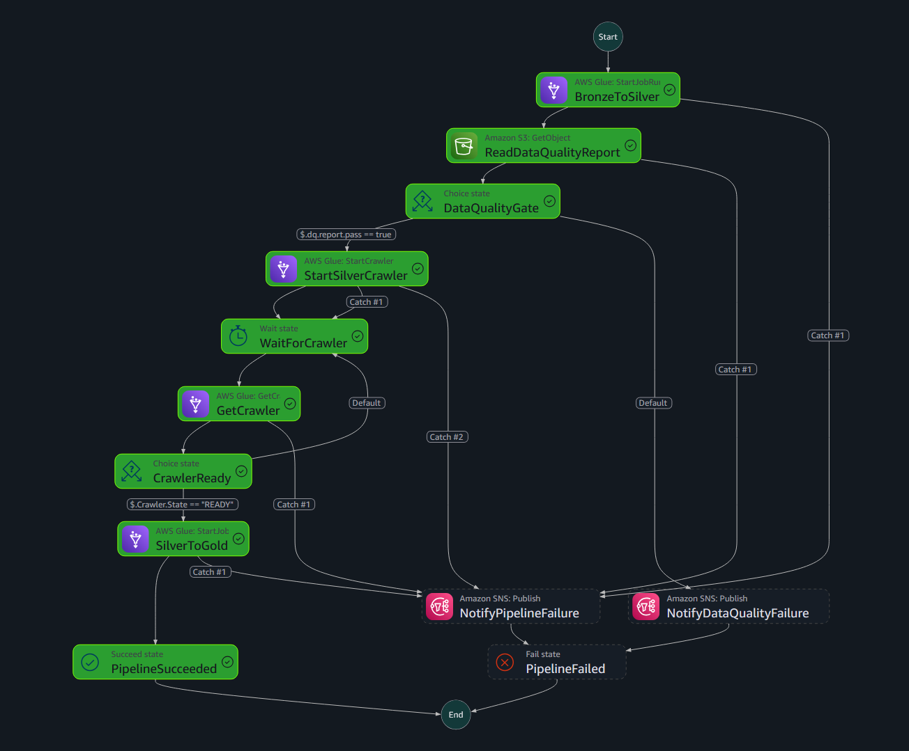

<p align="justify"><em>The DQ gate branch, and the actual failure it caught on the India file (Production Problem #14 above):</em></p>

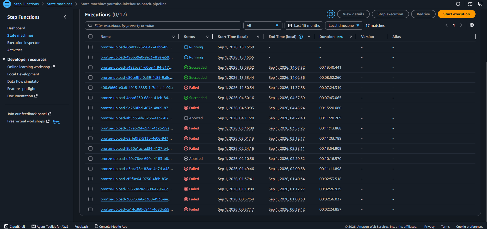
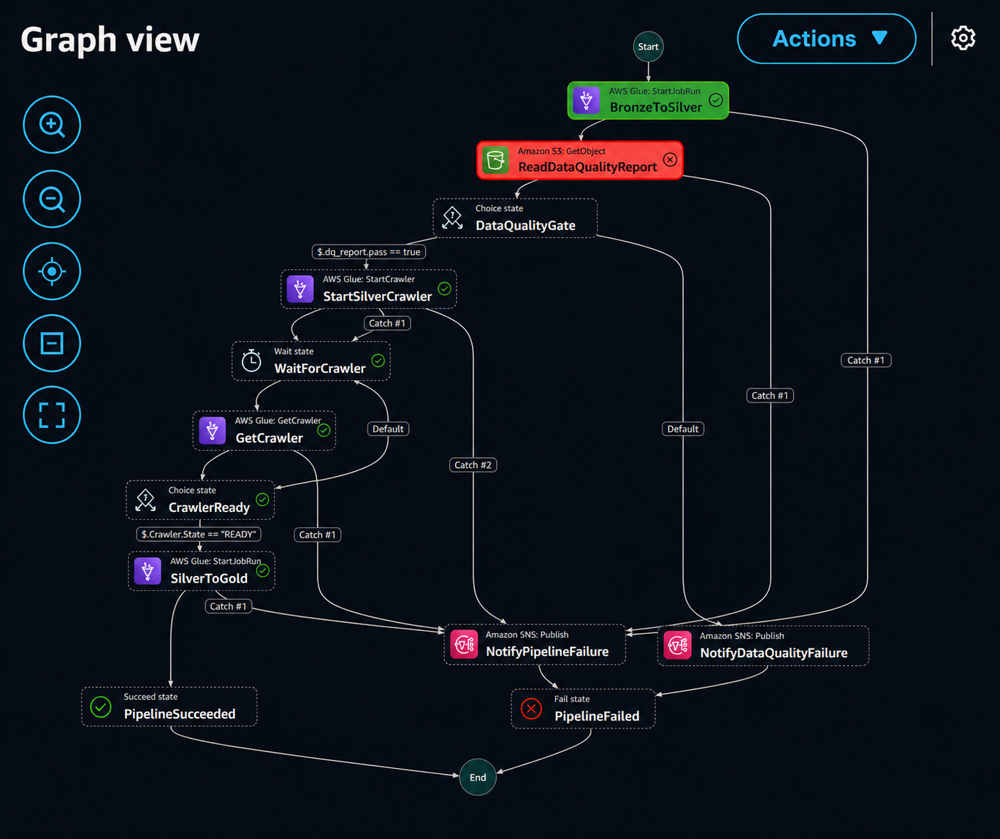

<p align="justify"><em>The <code>DQ_REPORT</code> itself, straight from CloudWatch logs - a clean US run next to the India run that actually tripped the gate on its 13.1% duplicate rate, and still correctly passes on <code>validity_rate</code> after the Problem #14 fix:</em></p>

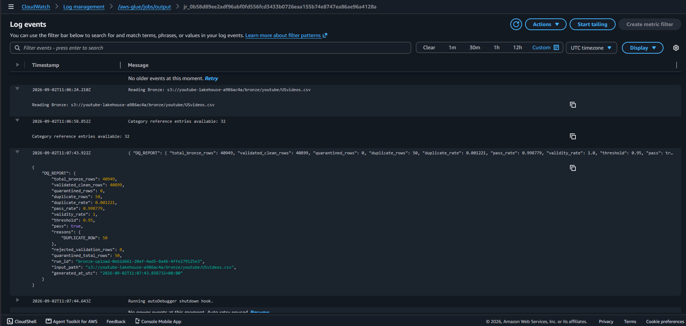
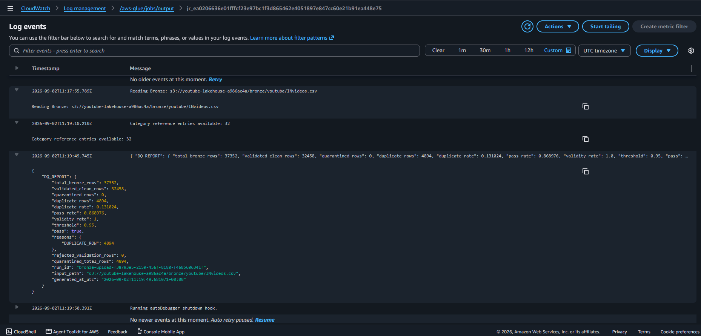

### Incremental Gold proof

<p align="justify"><em>Proof that <code>gold_incremental_mode</code> actually ran the watermark/<code>MERGE</code> path, not just that the code exists - the Glue job log showing the watermark filter and advance, next to the S3 control file it wrote:</em></p>

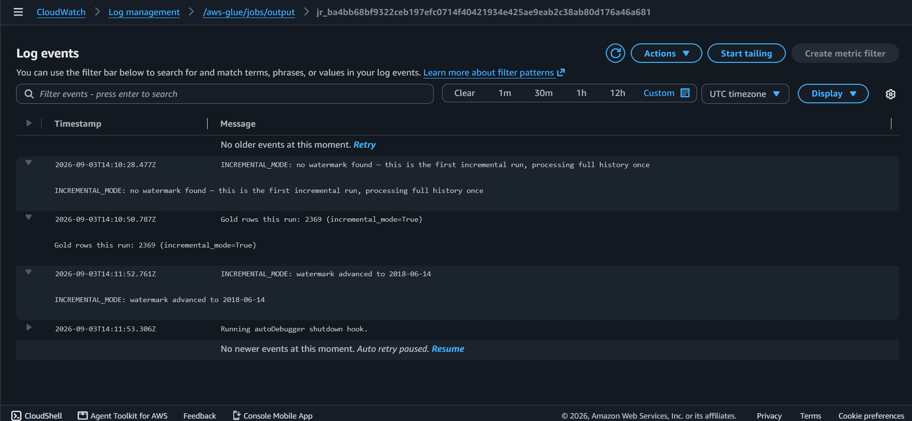
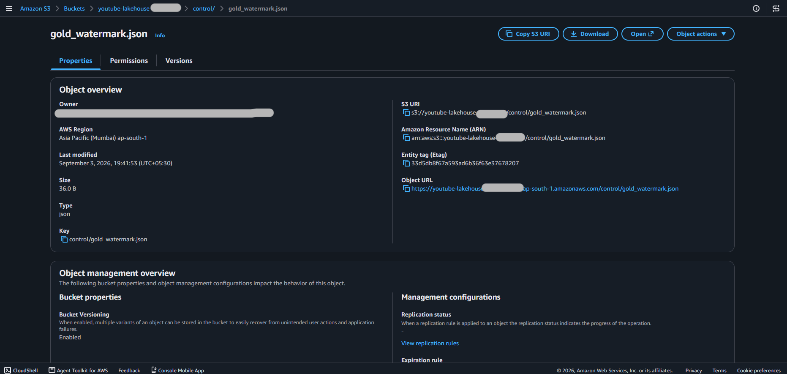

### Dashboard

| Views by category | Trend over time by region |
|---|---|
| 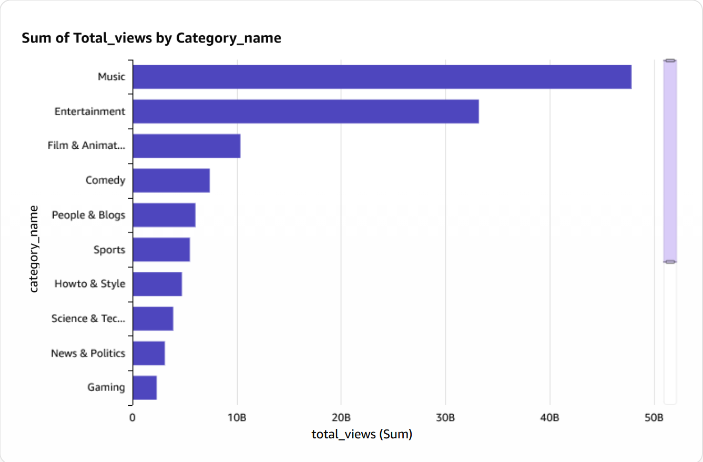 | 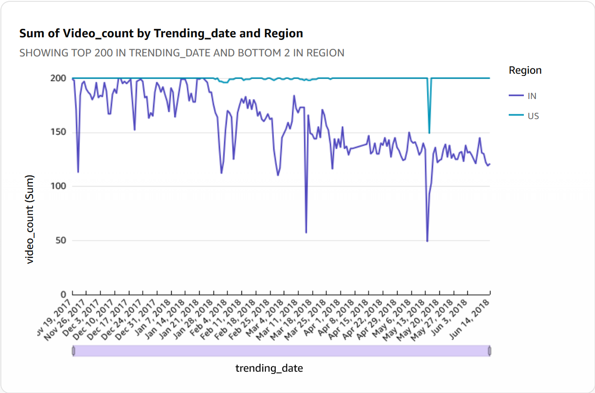 |

<p align="justify"><strong>Regional breakdown (category × region, with <code>avg_engagement_ratio</code> correctly set to Average aggregation):</strong></p>

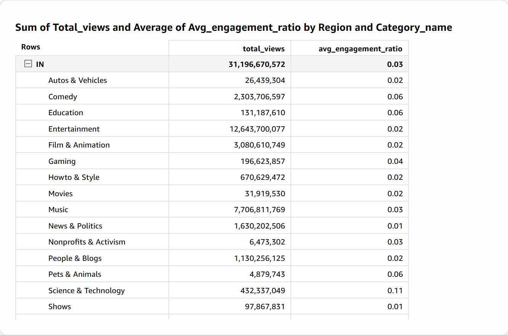

## 🧪 Local Tests

```bash
python3 -m venv .venv
source .venv/bin/activate
pip install -r requirements.txt
pytest tests/ -v

```

<p align="justify">83 tests covering transformation logic, the DQ report formula (including the duplicate-vs-invalid distinction from Production Problem #14), region resolution, deduplication, schema drift detection, API retry behavior, category-response parsing, and Lambda trigger behavior - all without an AWS account.</p>

## 🧹 Teardown & Cost Control

<p align="justify">QuickSight access disappears the moment the stack is destroyed, so capture screenshots first (see above). The S3 bucket is deliberately not <code>force_destroy</code>d, so empty it explicitly:</p>

```bash
aws s3 rm "s3://$(cd terraform && terraform output -raw lakehouse_bucket_name)" --recursive
cd terraform
terraform destroy -var="redshift_admin_password=$TF_VAR_redshift_admin_password"

```

<p align="justify">Read the destroy plan before confirming - same discipline as every apply. QuickSight's account subscription itself is separate from Terraform and isn't touched by <code>destroy</code>; cancel it separately in the QuickSight console if you're done with it entirely.</p>

## 🗣️ Interview Story

- **Bronze:** preserve source data as-is; region is derived from filename, not inferred from content.
- **Silver:** validate, normalize, deduplicate, quarantine bad rows with reasons, write partitioned Parquet.
- **Gold:** distributed category/day/region aggregation, full-refresh into a private warehouse.
- **Orchestration:** Step Functions owns retries, DQ branching, crawler sequencing, and failure alerting - Lambda is intentionally thin.
- **Data quality:** a real gate that has actually triggered on real data (see Production Problem #14) and was refined based on what tripped it - not a pipeline that's simply never seen messy input.
- **Warehouse:** Redshift Serverless, fully private, VPC-connected BI.
- **Ad hoc:** Athena reads Silver detail without forcing everything through Redshift.
- **Testing:** Python unit tests cover functional logic; dbt covers warehouse constraints and business rules; CI runs both plus Terraform validation on every push.
- **Security:** Secrets Manager, private Redshift, encrypted S3, blocked public access, TLS-only S3, least-privilege runtime roles, and nothing sensitive ever committed to git.
